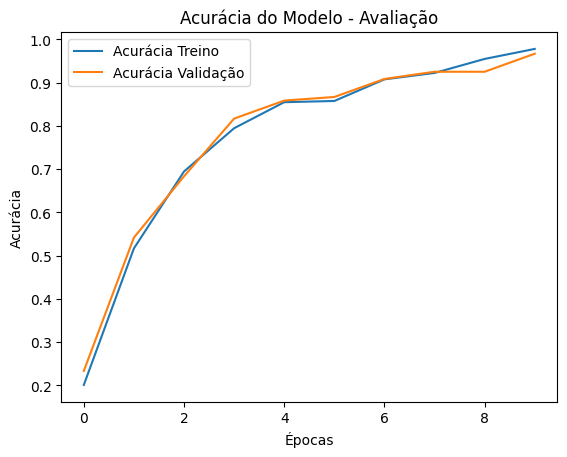

# Aprendizado de Máquina usando Rede Neural Convolucional

> Universidade Federal da Bahia
> 
> Docente: Eduardo Simas
> 
> Semestre: 2024.2

## Sobre o Trabalho

### Introdução

- Utiliação de uma rede neural convolucional para reconhecimento de sinais com a mão.

### Resultado

📊 **Analisando o Treinamento**

    Acurácia Inicial (Época 1):
        Treino: 17.28%
        Validação: 23.33%

    Melhora ao Longo das Épocas:
        A cada época, a acurácia de treino e validação aumentaram constantemente.
        Ou seja, houve o aprendizado dos dados.

    Última Época (Época 10):
        Treino: 97.64%
        Validação: 96.67%
        🔹 Os resultado obtidos foram bem promissores.

    Loss (Função de Perda):
        Treino: 0.893
        Validação: 0.1621
        🔹 Como a perca do treino e validação é baixa, tem-se que não há overfitting significativo.

### Treinamento do Modelo - Teste e Validação

## Equipe 6 - Colaboradores

<table>
  <tr>
    <td align="center"><a href="http://ivesvh.com"> <b>Elder Pereira 💻</b> </tr>
</table>

